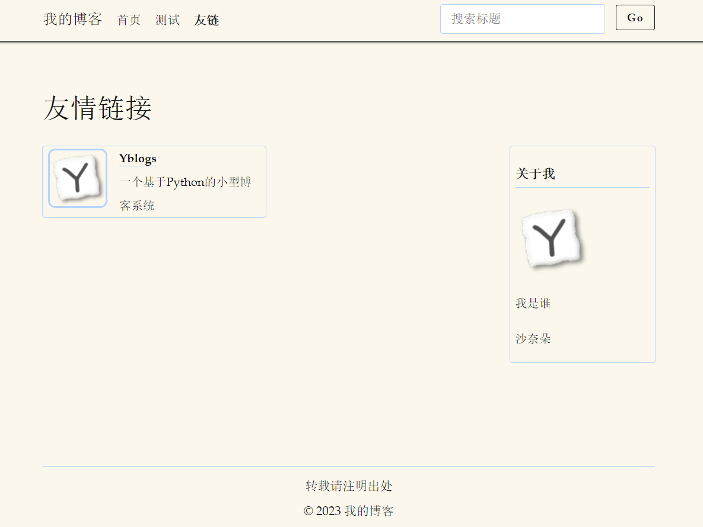

# Yblogs

一个基于Python的小型博客系统，支持主页浏览和简单的文章标题搜索。网页均为静态网页，可以用于Github Pages等托管平台。

## 依赖程序

[Python](https://www.python.org/) (3.6+)，用来执行脚本

[Pandoc](https://pandoc.org/) (2.9.1+)，用来将markdown转换成html

## 添加文章

1. 将写好的文章（markdown格式，扩展名`md`）放入markdown文件夹，注意文章最前面需要加上标题控制块：

   ```
   ---
   title: 标题
   ---
   ```

2. 修改`process`文件夹下的`passages.json`文件，添加文章的文件名（不包括扩展名）、文章分类、摘要、日期信息：

   ```json
       {
           "name": "文件名",
           "date": "日期",
           "category": "分类",
           "abstract": "摘要..."
       }
   ```

   主页文章显示的顺序会依照其在这个文件里出现的顺序。文章的大括号块之间需要用逗号隔开。

3. 用Python运行主目录下的`process.py`生成网页。本博客系统默认的是热更新，即只会将修改过的markdown文件转换成文章网页。如果修改了模板页面想强制转换所有文章网页，可以将`process.py`里的`force_html = False`改为`force_html = True`。

4. 部署，如果你用的是Github Pages，则在`myblog`文件夹下创建（第一次使用）或更新git仓库。

## 添加分类

注意index这个分类是必须存在的，因为网页必须有个index.html作为主页。

1. 将`process.py`里的`categories = ['index']`按实际需要给出分类的字符串列表，如改成`categories = ['index', 'miscellany']`。

2. 将`process`文件夹里的`index.html`复制一份，名字改成对应分类的名字，如`miscellany.html`，作为新分类的主页模板，然后随需要修改该网页内的内容，如导航栏、公告栏等，未来脚本会根据对应分类文章数量自动生成`miscellany.html`、`miscellany/2.html`、`miscellany/3.html`等。

3. 将其他网页模板（如`index.html`、`template.html`、`search.html`的导航栏也进行修改，使得其他网页也有指向新分类主页的链接，新分页的首页就是`对应分类名.html`，如`miscellany.html`，所以链接指向它即可，后面会介绍如何修改导航栏。

## 添加友情链接

修改`process`文件夹下的`friends.json`文件，添加友链名称、网址、描述、图标:

```json
    {
        "name": "友链名称",
        "url": "友链网址",
        "description": "友链描述",
        "avatar": "友链图标"
    }
```

主目录下的`process.py`每次运行也会调用`friends.py`对友链页面进行更新。

## 定制网页

本博客系统主要包含分类主页模板、文章页模板、友链页和搜索页四类页面，分别对应的模板页面为process文件夹下的`index.html`及其他`对应分类名.html`、`template.html`、`friends.html`和`search.html`。为了格式的统一性可能需要在多个地方进行相似的修改。

### 定制html

#### 修改导航栏

分类主页模板、`template.html`、`friends.html`和`search.html`都包含导航栏，具体就是找到页面中的`<nav>`标签：

```html
        <nav>
            <ul>
                <li><big>我的博客</big></li>
                <li><a href="/index.html">首页</a></li>
                <li><a href="/html/markdown测试.html">测试</a></li>
                <li class="float-right sticky"><button onclick="search()">Go</button></li>
                <li class="float-right sticky"><input type="text" placeholder="搜索"></li>
            </ul>
        </nav>
```

参照示例添加或修改其中的`<li>`和`<a>`节点内容。

#### 修改页尾栏

分类主页模板、`template.html`、`friends.html`和`search.html`都包含页尾栏，具体就是找到页面中的`<footer>`标签：

```html
        <footer>
            <hr><center>转载请注明出处<br>© 2023 我的博客</center>
        </footer>
```

参照示例添加或修改其中的文字内容。

#### 修改信息栏

只有分类主页模板和`friends.html`包含信息栏，具体就是找到页面中的类名为`card`的`<div`>标签：

```html
                <div class="card">
                    <p>关于我</p>
                    </img>
                    <p>个人介绍</p>
                    <p>
                    <a href="https://github.com/ZimingYuan" target="_BLANK">Github</a>
                    </p>
                </div>;
```

参照示例添加或修改其中的文件内容，``标签修改头像图片。

#### 修改标题栏

* 修改分类主页模板、`template.html`、`friends.html`和`search.html`的标题栏图标的方法是找到其中的`<link>`标签：

	```html
        <link rel="icon" href="/img/favicon.ico" type="image/x-icon" />
        <link rel="shortcut icon" href="/img/favicon.ico" type="image/x-icon" />
	```

	修改图片链接。

* 修改主页标题栏文字的方法是编辑`index.py`，修改其中的title变量：

	```python
    title = '我的博客首页（第{}页）'
	```

	大括号是用来自动填入页码的不要改，其他的文字都可以改。

### 定制样式

本系统使用的样式表是[Classless.css](https://classless.de/)，你也可以使用其他的样式表，修改方法：

* 对于分类主页和搜索页，直接在分类主页模板和`search.html`的`<head>`标签里加入对应的样式表（或脚本）：

  ```html
          <link rel="stylesheet" href="/extra/classless.css" />
  ```

* 对于文章页，需要编辑`process.py`，修改其中执行pandoc命令的语句：

  ```python
          command = f'pandoc --template={pc_dir}/template.html -c /extra/classless.css --mathjax {i} -o {html}'
  ```

  把要用的css写在`-c`命令行参数后面，脚本则还是在`template.html`做对应的修改。

* Classless.css提供了主题系统，可以修改页面的宽度，配色什么的，如果要修改主题需要修改`index.html`、`template.html`和`search.html`三个文件里的`<style>`标签：

  ```html
  <style>
  html[data-theme='tufte']{
      --rem: 15px;
      --navpos: absolute;
      --width: 70rem;
      --font-p: 1.4rem/2 et-book, Palatino, "Palatino Linotype", "Palatino LT STD", "Book Antiqua", Georgia, serif;
      --font-h: 1.4rem/1.5 et-book, Palatino, "Palatino Linotype", "Palatino LT STD", "Book Antiqua", Georgia, serif;
      --font-c: .9em/1.4 Consolas,"Liberation Mono","Courier New",monospace;
      --ornament: "";
      --border: 1px solid var(--cmed);
      /* foreground   | background color */
      --cfg:   #111;    --cbg:    #fbf7ec;
      --cdark: #111;    --clight: #fbf7ec;
      --cmed: #b4d5fe;
      --clink: #111;
      --cemph: #111;
  }
  </style>
  ```

  具体各参数的含义详见Classless.css的官网。
  
## 展示

### 首页


### 文章页


### 搜索页


### 友链页

