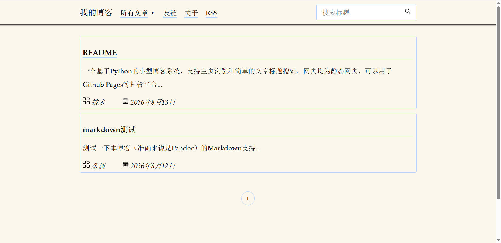
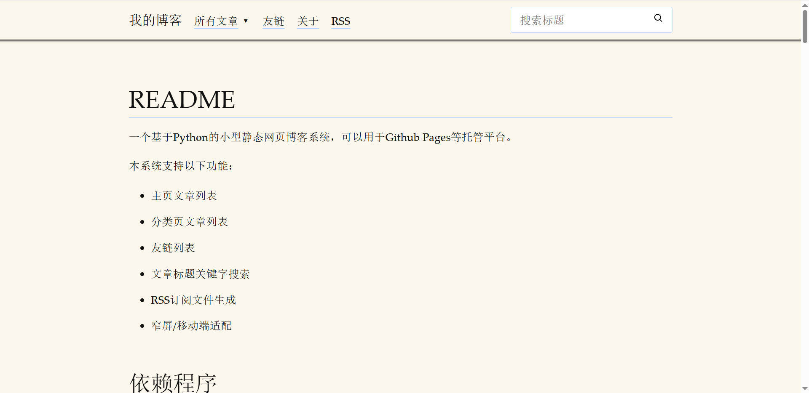
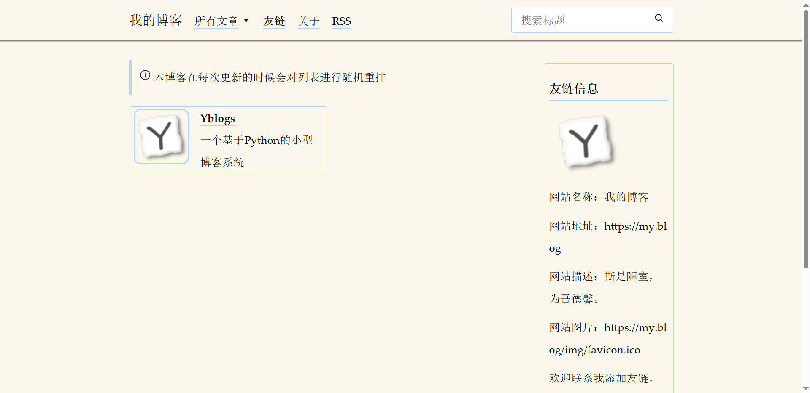
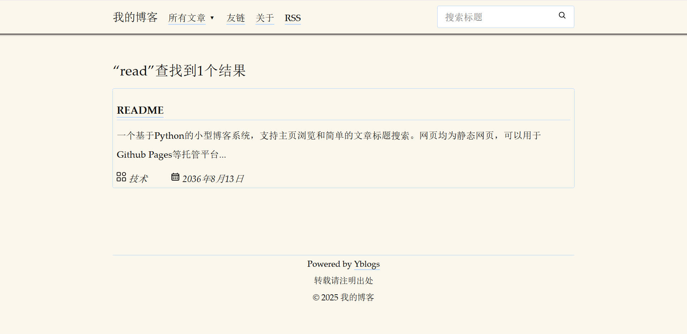
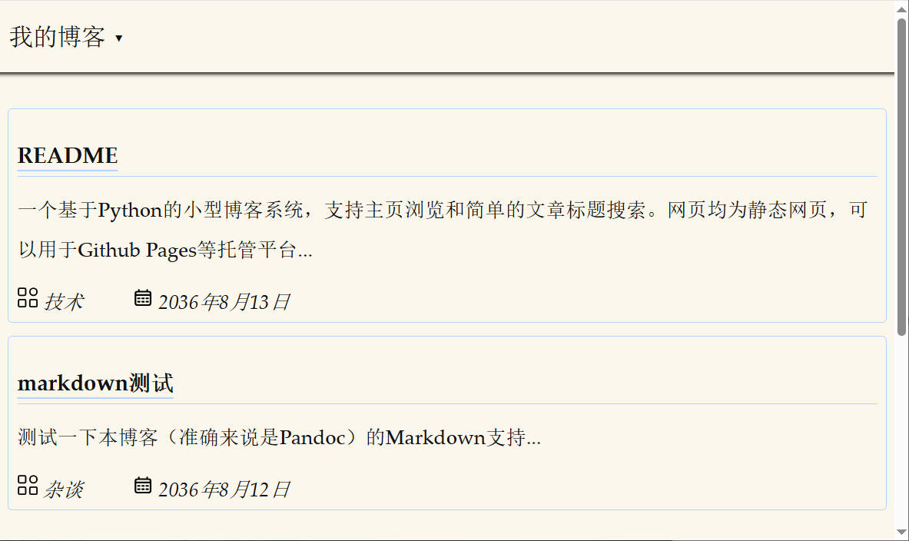

# Yblogs

一个基于Python的小型静态网页博客系统，可以用于Github Pages等托管平台。

本系统支持以下功能：

* 主页文章列表
* 分类页文章列表
* 友链列表
* 文章标题关键字搜索
* RSS订阅文件生成
* 窄屏/移动端适配

## 依赖程序

[Python](https://www.python.org/) (3.6+)，用来执行脚本

[Pandoc](https://pandoc.org/) (2.9.1+)，用来将markdown转换成html

## 添加文章

1. 将写好的文章（markdown格式，扩展名`md`）放入markdown文件夹，注意文章最前面需要加上标题控制块：

   ```
   ---
   title: 标题
   keywords: 这一行, 可加, 可不加, 仅用于, 方便, 搜索引擎, 索引
   ---
   ```

2. 修改`process`文件夹下的`passages.json`文件，添加文章的文件名（不包括扩展名）、文章分类、摘要、日期信息：

   ```json
       {
           "name": "文件名",
           "date": "日期",
           "category": "分类",
           "abstract": "摘要..."
       }
   ```

   主页文章显示的顺序会依照其在这个文件里出现的顺序。文章的大括号块之间需要用逗号隔开。

3. 用Python运行主目录下的`process.py`生成网页。本博客系统默认的是热更新，即只会将修改过的markdown文件转换成文章网页。如果修改了模板页面想强制转换所有文章网页，可以将`process.py`里的`force_html = False`改为`force_html = True`。

4. 部署，如果你用的是Github Pages，则在`myblog`文件夹下创建（第一次使用）或更新git仓库。

## 编辑分类

目前本仓库包含了技术和杂谈两个分类，你可以根据需要添加或删除分类。

1. 将`process.py`里的`categories = {'technique': '技术', 'miscellany': '杂谈'}`按实际需要进行更改，键值对的键是分类的英文名称，值是分类的中文名称。英文名称通常用在程序中，中文名称则是显示在列表页和搜索页上的分类名称。

2. 对`process`文件夹里的`分类英文名.html`进行修改，如`miscellany.html`，作为该分类的主页模板，然后随需要修改该网页内的内容，如导航栏、公告栏等，后续脚本会根据对应分类文章数量自动生成`miscellany.html`、`miscellany/2.html`、`miscellany/3.html`等。

3. 将所有网页模板（如`index.html`、`template.html`、`search.html`的导航栏也进行修改，使得其他网页也有指向新分类主页的链接，新分类主页的首页就是`分类英文名.html`，如`miscellany.html`，所以链接指向它即可，后面会介绍如何修改导航栏。

## 添加友情链接

修改`process`文件夹下的`friends.json`文件，添加友链名称、网址、描述、图标:

```json
    {
        "name": "友链名称",
        "url": "友链网址",
        "description": "友链描述",
        "avatar": "友链图标"
    }
```

主目录下的`process.py`每次运行也会调用`friends.py`对友链页面进行更新。

## 定制网页

本博客系统主要包含分类主页模板、分类页、文章页模板、友链页和搜索页四类页面，分别对应的模板页面为process文件夹下的`index.html`及其他`分类英文名.html`、`template.html`、`friends.html`和`search.html`。为了格式的统一性可能需要在多个地方进行相似的修改。

### 定制html

#### 修改导航栏

主页模板、分类页模板、`template.html`、`friends.html`和`search.html`都包含导航栏，具体就是找到页面中的`<nav>`标签：

```html
        <nav>
            <ul>
                <li><big>我的博客</big></li>
                <li><a href="/index.html"><strong>所有文章</strong></a> ▾
                    <ul>
                        <li><a href="/technique.html">技术</a></li>
                        <li><a href="/miscellany.html">杂谈</a></li>
                    </ul>
                </li>
                <li><a href="/friends.html">友链</a></li>
                <li><a href="/html/关于.html">关于</a></li>
                <li><a href="/extra/atom.xml">RSS</a></li>
                <li class="float-right">
                    <div style="position: relative; display: inline-block;">
                        <input type="search" placeholder="搜索标题" style="margin: 0; padding-right: 2em;">
                        <button style="position: absolute; right: 0; top: 50%; transform: translateY(-50%); border: none; background: transparent; margin: 0;" onclick="search()">
                            <svg width="1em" height="1em" viewBox="0 0 24 24" fill="none" xmlns="http://www.w3.org/2000/svg"><g id="SVGRepo_bgCarrier" stroke-width="0"></g><g id="SVGRepo_tracerCarrier" stroke-linecap="round" stroke-linejoin="round"></g><g id="SVGRepo_iconCarrier"> <path d="M15.7955 15.8111L21 21M18 10.5C18 14.6421 14.6421 18 10.5 18C6.35786 18 3 14.6421 3 10.5C3 6.35786 6.35786 3 10.5 3C14.6421 3 18 6.35786 18 10.5Z" stroke="#000000" stroke-width="2" stroke-linecap="round" stroke-linejoin="round"></path> </g></svg>
                        </button>
                    </div>
                </li>
            </ul>
        </nav>
```

参照示例添加或修改其中的`<li>`和`<a>`节点内容。

另外，这个导航栏里的“关于”指向的是用Markdown写的文章，你也可以自由将导航栏的链接指向任意地方。这类文章没有在`passages.json`里定义，因此文章列表里不会显示入口，但会生成html文件。你还可以通过在Markdown里插入script标签来让这种文章产生一些特殊的效果。

#### 修改页尾栏

主页模板、分类页模板、`template.html`、`friends.html`和`search.html`都包含页尾栏，具体就是找到页面中的`<footer>`标签：

```html
        <footer>
            <hr><center>转载请注明出处<br>© 2025 我的博客</center>
        </footer>
```

参照示例添加或修改其中的文字内容。

### 定制样式

本系统使用的样式表是我定制的[Classless.css](https://classless.de/)，你也可以使用其他的样式表，修改方法：

* 对于分类主页和搜索页，直接在分类主页模板和`search.html`的`<head>`标签里加入对应的样式表（或脚本）：

  ```html
          <link rel="stylesheet" href="/extra/classless.css" />
  ```

* 对于文章页，需要编辑`process.py`，修改其中执行pandoc命令的语句：

  ```python
          command = f'pandoc --template={pc_dir}/template.html -c /extra/classless.css --mathjax {i} -o {html}'
  ```

  把要用的css写在`-c`命令行参数后面，脚本则还是在`template.html`做对应的修改。

* Classless.css提供了主题系统，可以修改页面的宽度，配色什么的，如果要修改主题需要修改`extra/classless.css`里的样式。

```css
  :root, html[data-theme='tufte']{
    --rem: 15px;
    --navpos: absolute;
    --width: 70rem;
    --font-p: 1.4rem/2 et-book, Palatino, "Palatino Linotype", "Palatino LT STD", "Book Antiqua", Georgia, serif;
    --font-h: 1.4rem/1.5 et-book, Palatino, "Palatino Linotype", "Palatino LT STD", "Book Antiqua", Georgia, serif;
    --font-c: .9em/1.4 Consolas,"Liberation Mono","Courier New",monospace;
    --ornament: "";
    --border: 1px solid var(--cmed);
    /* foreground   | background color */
    --cfg:   #111;    --cbg:    #fbf7ec;
    --cdark: #111;    --clight: #fbf7ec;
    --cmed: #b4d5fe;
    --clink: #111;
    --cemph: #111;
    --fold-width: 55rem;
}
```

具体各参数的含义详见Classless.css的官网。这里的`data-theme`需要能和各页面的html标签里的`data-theme`对应起来，才能生效。

另外，这里的`--fold-width`参数是我定义的一个参数，用来指定屏幕宽度小于多少需要折叠，你可以根据实际需要修改。
  
## 展示

### 首页



### 文章页



### 友链页



### 搜索页



### 窄屏导航栏折叠

