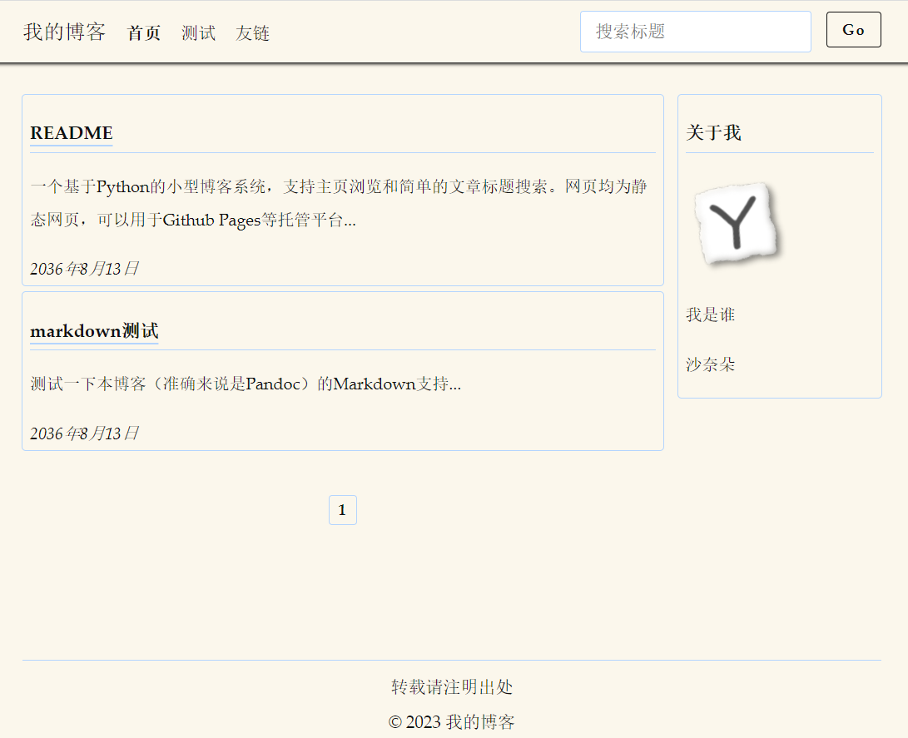

# Yblogs

一个基于Python的小型博客系统，支持主页浏览和简单的文章标题搜索。网页均为静态网页，可以用于Github Pages等托管平台。

## 依赖程序

[Python](https://www.python.org/) (3.6+)，用来执行脚本

[Pandoc](https://pandoc.org/) (2.9.1+)，用来将markdown转换成html

## 添加文章

1. 将写好的文章（markdown格式，扩展名`md`）放入markdown文件夹，注意文章最前面需要加上标题控制块：

   ```
   ---
   title: 标题
   ...
   ```

2. 修改process文件夹下的passages.json文件，添加文章的文件名（不包括扩展名）、摘要、日期信息：

   ```json
       {
           "name": "文件名",
           "date": "日期",
           "abstract": "摘要..."
       }
   ```

   主页文章显示的顺序会依照其在这个文件里出现的顺序。文章的大括号块之间需要用逗号隔开。

3. 用Python运行主目录下的process.py生成网页。
4. 部署，如果你用的是Github Pages，则在myblog文件夹下创建（第一次使用）或更新git仓库。

## 定制网页

本博客系统主要包含主页、文章页和搜索页三类页面，分别对应的模板页面为process文件夹下的`index.html`、`template.html`和`search.html`。为了格式的统一性可能需要在多个地方进行相似的修改。

### 定制html

#### 修改导航栏

`index.html`、`template.html`和`search.html`都包含导航栏，具体就是找到页面中的`<nav>`标签：

```html
        <nav>
            <ul>
                <li><big>我的博客</big></li>
                <li><a href="/index.html">首页</a></li>
                <li><a href="/html/markdown测试.html">测试</a></li>
                <li class="float-right sticky"><button onclick="search()">Go</button></li>
                <li class="float-right sticky"><input type="text" placeholder="搜索"></li>
            </ul>
        </nav>
```

参照示例添加或修改其中的`<li>`和`<a>`节点内容。

#### 修改页尾栏

`index.html`、`template.html`和`search.html`都包含页尾栏，具体就是找到页面中的`<footer>`标签：

```html
        <footer>
            <hr><center>转载请注明出处<br>© 2022 我的博客</center>
        </footer>
```

参照示例添加或修改其中的文字内容。

#### 修改信息栏

只有`index.html`包含信息栏，具体就是找到页面中的类名为`card info`的`<div`>标签：

```html
                <div class="card info">
                    <p>关于我</p>
                    </img>
                    <p>个人介绍</p>
                    <p>
                    <a href="https://github.com/ZimingYuan" target="_BLANK">Github</a>
                    </p>
                </div>;
```

参照示例添加或修改其中的文件内容，``标签修改头像图片。

#### 修改标题栏

* 修改`index.html`、`template.html`和`search.html`的标题栏图标的方法是找到其中的`<link>`标签：

	```html
        <link rel="icon" href="/img/favicon.ico" type="image/x-icon" />
        <link rel="shortcut icon" href="/img/favicon.ico" type="image/x-icon" />
	```

	修改图片链接。

* 修改主页标题栏文字的方法是编辑`index.py`，修改其中的title变量：

	```python
    title = '我的博客首页（第{}页）'
	```

	大括号是用来自动填入页码的不要改，其他的文字都可以改。

### 定制样式

本系统使用的样式表是[Classless.css](https://classless.de/)，你也可以使用其他的样式表，修改方法：

* 对于主页和搜索页，直接在`index.html`和`search.html`的`<head>`标签里加入对应的样式表（或脚本）：

  ```html
          <link rel="stylesheet" href="/extra/classless.css" />
  ```

* 对于文章页，需要编辑`process.py`，修改其中执行pandoc命令的语句：

  ```python
          command = f'pandoc --template={pc_dir}/template.html -c /extra/classless.css --mathjax {i} -o {html}'
  ```

  把要用的css写在`-c`命令行参数后面，脚本则还是在`template.html`做对应的修改。

* Classless.css提供了主题系统，可以修改页面的宽度，配色什么的，如果要修改主题需要修改`index.html`、`template.html`和`search.html`三个文件里的`<style>`标签：

  ```html
  <style>
  html[data-theme='tufte']{
      --rem: 15px;
      --navpos: absolute;
      --width: 70rem;
      --font-p: 1.4rem/2 et-book, Palatino, "Palatino Linotype", "Palatino LT STD", "Book Antiqua", Georgia, serif;
      --font-h: 1.4rem/1.5 et-book, Palatino, "Palatino Linotype", "Palatino LT STD", "Book Antiqua", Georgia, serif;
      --font-c: .9em/1.4 Consolas,"Liberation Mono","Courier New",monospace;
      --ornament: "";
      --border: 1px solid var(--cmed);
      /* foreground   | background color */
      --cfg:   #111;    --cbg:    #fbf7ec;
      --cdark: #111;    --clight: #fbf7ec;
      --cmed: #b4d5fe;
      --clink: #111;
      --cemph: #111;
  }
  </style>
  ```

  具体各参数的含义详见Classless.css的官网。

## 展示

### 首页



### 文章页


### 搜索页

